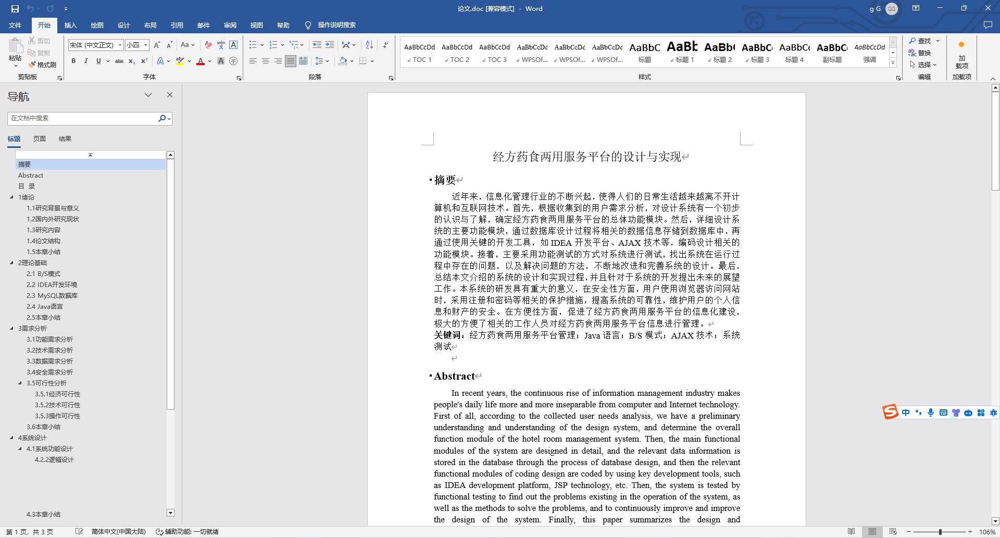
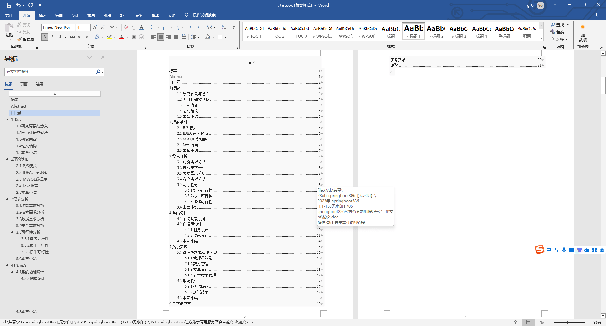
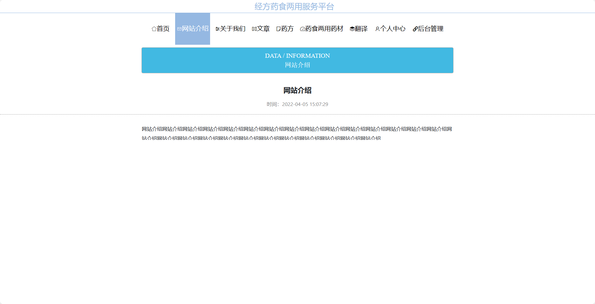
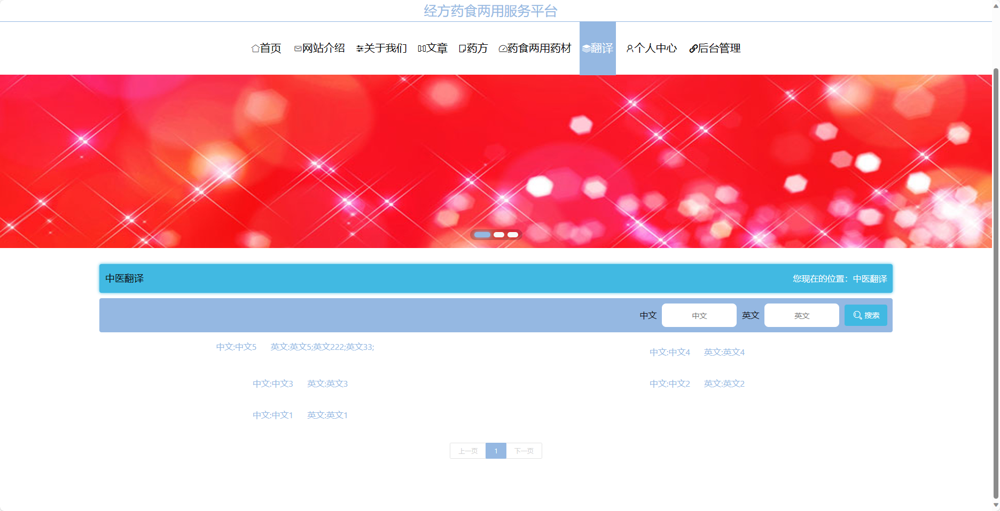
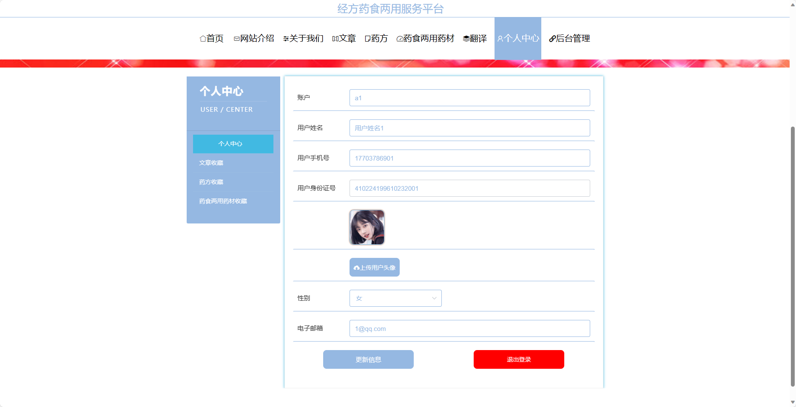
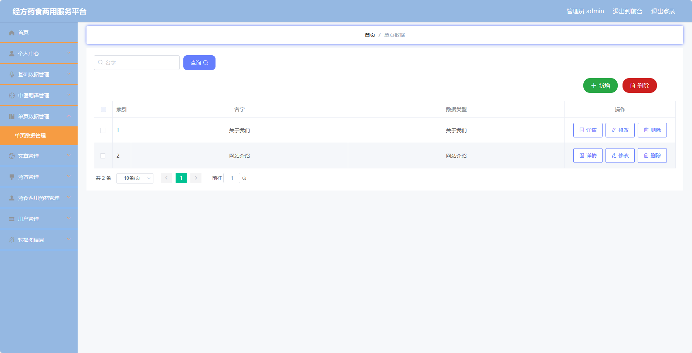
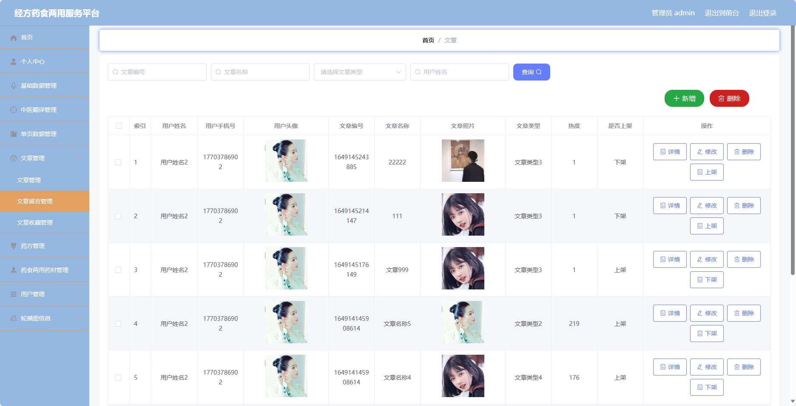
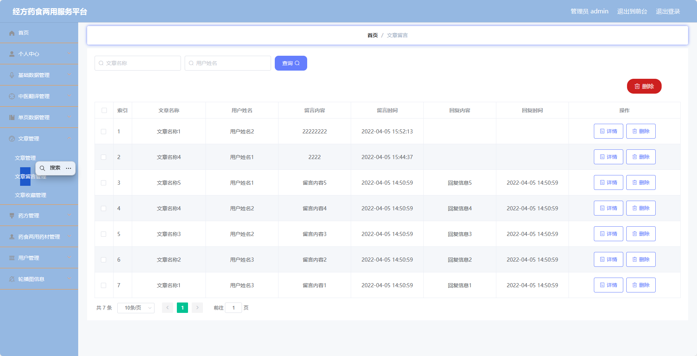

基于SpringBoot的经方药食两用服务平台（程序+论文）
=
- 完整代码获取地址：从戎源码网 ([https://armycodes.com/](https://armycodes.com/))
- 作者微信：19941326836  QQ：952045282 
- 承接计算机毕业设计、Java毕业设计、Python毕业设计、深度学习、机器学习
- 选题+开题报告+任务书+程序定制+安装调试+论文+答辩ppt 一条龙服务
- 所有选题地址https://github.com/nature924/allProject

一、项目介绍
---
基于Spring Boot框架实现的经方药食两用服务平台，系统包含两种角色：管理员、用户,系统分为前台和后台两大模块，主要功能如下。
### 前台：
- 首页：展示网站的核心内容和功能入口。
- 网站介绍：介绍经方药食两用服务平台的宗旨、使命和特色。
- 关于我们：展示平台团队的背景和成员信息。
- 文章：提供中医药相关的文章。
- 药方：提供中医药方的查询和分享。
- 药食两用药材：介绍常见的药食两用药材及其功效、用法等信息。
- 翻译：提供中医术语、药材名称等的中英文翻译服务。
- 个人中心：用户可以管理个人信息。

### 后台：
- 用户：
  - 个人中心：用户可以管理个人信息，包括修改个人资料、查看收藏的文章和药方等。
  - 中医翻译管理：管理员可以管理中医术语、药材名称等的翻译信息，包括添加、编辑、删除翻译等操作。
  - 文章管理：管理员可以管理文章信息，包括发布、编辑、删除文章等操作。
  - 药方管理：管理员可以管理药方信息，包括添加、编辑、删除药方等操作。
  - 药食两用药材管理：管理员可以管理药食两用药材信息，包括添加、编辑、删除药材等操作。
- 管理员：
  - 个人中心：管理员可以管理个人信息，包括修改个人资料。
  - 基础数据管理：管理员可以管理系统的基础数据，包括用户信息、角色权限等。
  - 中医翻译管理：管理员可以管理中医术语、药材名称等的翻译信息，包括添加、编辑、删除翻译等操作。
  - 单页数据管理：管理员可以管理网站的单页数据，包括网站介绍、关于我们等内容的编辑和更新。
  - 文章管理：管理员可以管理文章信息，包括发布、编辑、删除文章等操作。
  - 药方管理：管理员可以管理药方信息，包括添加、编辑、删除药方等操作。
  - 药食两用药材管理：管理员可以管理药食两用药材信息，包括添加、编辑、删除药材等操作。
  - 用户管理：管理员可以管理用户信息，包括添加、编辑、删除用户等操作。
  - 轮播图信息：管理员可以管理网站首页的轮播图信息，包括添加、编辑、删除轮播图等操作。

二、项目技术
---
- 编程语言：Java
- 数据库：MySQL
- 项目管理工具：Maven
- 前端技术：VUE、HTML、Jquery、Bootstrap
- 后端技术：Spring、SpringMVC、MyBatis

三、运行环境
---
- 操作系统：Windows、macOS都可以
- JDK版本：JDK1.8以上都可以
- 开发工具：IDEA、Ecplise、Myecplise都可以
- 数据库: MySQL5.7以上都可以
- Tomcat：任意版本都可以
- Maven：任意版本都可以

四、运行截图
---
### 论文截图：

### 程序截图：

